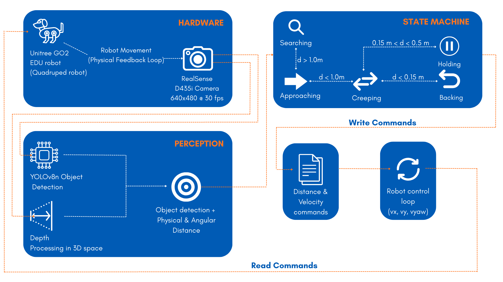

B.O.L.T – Behavioral Object Locomotion & Tracking

B.O.L.T is a real-time vision-guided object tracking system for the Unitree Go2 quadruped robot. 
The system integrates a custom-trained YOLOv8 object detector, monocular depth estimation, and a state-based control architecture to autonomously detect, 
track, and follow objects with sub-50 ms latency on edge hardware.

🚀 Features
Real-time object detection using YOLOv8
Monocular depth-based distance estimation (Intel RealSense)
Closed-loop perception → control pipeline
Finite State Machine (FSM) for smooth and safe locomotion
Dynamic target switching (green / pink / yellow ball)
Edge deployment optimized for Jetson Nano
Live MJPEG video streaming for monitoring

🧠 System Overview
Camera → Object Detection → Depth Estimation → FSM Control → Velocity Commands → Robot Motion
The system continuously updates motion commands based on the latest visual feedback, enabling responsive and stable autonomous tracking without relying on SLAM.

🏗️ Architecture
Hardware
1. Unitree Go2 Quadruped
2. Intel RealSense RGB-D Camera
3. NVIDIA Jetson Nano

Software
1. Python
2. YOLOv8 (Ultralytics)
3. OpenCV
4. ROS / ROS2 (for robot communication)

📊 Performance
1. Average latency: ~48 ms
2. Worst-case latency: ~61 ms
3. Detection accuracy: mAP@0.5 ≈ 0.995
4. Tracking success rate: >90% (indoor environments)
5. Robustness: Works across varied lighting conditions

👥 Authors
Sahil Sawant - sahilshi@buffalo.edu
Atharva Prabhu - aprabhu5@buffalo.edu

EAS 563 – AI Capstone
University at Buffalo
Advisor: Prof. David Doermann
